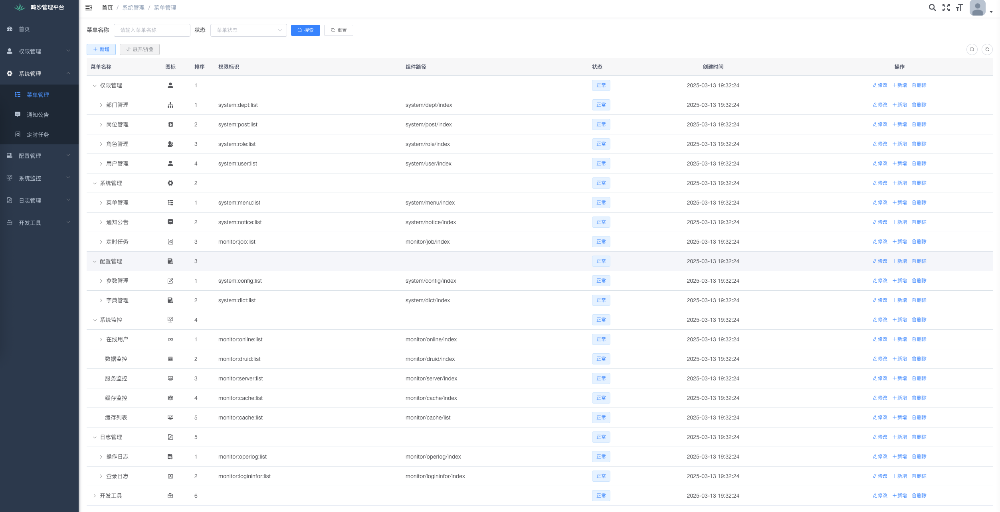

# 🚀 鸣沙管理平台

**企业级前后端分离管理系统 | 基于 Spring Boot 3 + Vue 2**

**🎯 快速构建企业级管理系统 | 🔐 完善的权限控制 | 📊 丰富的监控功能 | 🐳 容器化部署支持**

[📖 在线文档](https://github.com/chenlong220192/mingsha-template-vue) | [📚 文档导航](#-文档导航) | [📋 功能特性](#-功能特性) | [🔧 技术栈](#-技术栈) | [📦 贡献指南](#-贡献指南)

---

## 📋 目录

- [🎯 项目简介](#-项目简介)
- [✨ 功能特性](#-功能特性)
- [🔧 技术栈](#-技术栈)
- [📚 文档导航](#-文档导航)
- [🤝 贡献指南](#-贡献指南)
- [📄 许可证](#-许可证)

---

## 🎯 项目简介

**鸣沙管理平台** 是一个基于 Spring Boot 3 + Vue 2 的企业级前后端分离管理系统，提供完整的用户管理、权限控制、系统监控、数据管理等功能。系统采用现代化的技术栈，支持容器化部署，适用于各种规模的企业应用。

> **📝 项目来源**: 本项目 Forked from [若依管理系统](https://doc.ruoyi.vip/)，感谢若依团队提供的优秀开源项目基础。

### 🎨 系统截图

#### 🔐 登录页面

#### 📋 菜单管理

### 🌟 核心优势

- **🚀 高性能**：基于 Spring Boot 3 的高性能后端架构
- **🎨 现代化**：Vue 2 + Element UI 的现代化前端界面
- **🔐 安全性**：完善的权限控制和数据安全保护
- **📱 响应式**：完美支持桌面端和移动端访问
- **🐳 容器化**：支持 Docker 和 Kubernetes 部署
- **📊 监控完善**：丰富的系统监控和性能分析功能

---

## ✨ 功能特性

### 🔐 用户权限管理
- **用户管理**：用户注册、登录、信息维护
- **角色管理**：角色分配、权限配置
- **权限控制**：细粒度的功能权限和数据权限
- **部门管理**：组织架构管理
- **菜单管理**：动态菜单配置

### 📊 系统监控
- **在线用户**：实时监控在线用户状态
- **操作日志**：详细的操作记录和审计
- **登录日志**：用户登录历史记录
- **服务监控**：系统性能和服务状态监控
- **缓存监控**：Redis 缓存状态监控

### 🛠️ 系统工具
- **代码生成**：自动生成 CRUD 代码
- **系统配置**：系统参数配置管理
- **数据字典**：数据字典维护
- **定时任务**：定时任务管理和执行
- **文件管理**：文件上传下载管理

### 📈 数据管理
- **数据导入导出**：Excel 数据导入导出
- **数据备份**：数据库备份和恢复
- **数据统计**：数据统计和分析
- **报表管理**：自定义报表生成

---

## 🔧 技术栈

### 后端技术

| 技术 | 版本 | 说明 |
|------|------|------|
| **Java** | 17 | 基础运行环境 |
| **Spring Boot** | 3.5.3 | 应用框架 |
| **Spring Security** | 6.x | 安全框架 |
| **MyBatis** | 3.x | ORM 框架 |
| **MySQL** | 8.x | 数据库 |
| **Redis** | 6.x | 缓存数据库 |
| **Maven** | 3.x | 构建工具 |
| **JWT** | 0.12.6 | 身份认证 |
| **SpringDoc** | 2.8.4 | API 文档 |

### 前端技术

| 技术 | 版本 | 说明 |
|------|------|------|
| **Vue.js** | 2.6.12 | 前端框架 |
| **Element UI** | 2.15.14 | UI 组件库 |
| **Vue Router** | 3.4.9 | 路由管理 |
| **Vuex** | 3.6.0 | 状态管理 |
| **Axios** | 0.24.0 | HTTP 客户端 |
| **ECharts** | 5.4.0 | 图表库 |
| **Node.js** | 16+ | 开发环境 |

### 部署技术

| 技术 | 版本 | 说明 |
|------|------|------|
| **Docker** | 20+ | 容器化部署 |
| **Kubernetes** | 1.20+ | 容器编排 |
| **Helm** | 3.x | 包管理工具 |
| **Jenkins** | 2.x | CI/CD 工具 |
| **Nginx** | 1.20+ | 反向代理 |

---

## 📚 文档导航

| 文档 | 说明 | 链接 |
|------|------|------|
| **00. 📚 文档索引** | 快速查找所需文档 | [docs/00-文档索引.md](docs/00-文档索引.md) |
| **01. 🚀 快速开始** | 环境搭建和项目启动 | [docs/01-快速开始.md](docs/01-快速开始.md) |
| **02. 📚 开发指南** | 开发规范和最佳实践 | [docs/02-开发指南.md](docs/02-开发指南.md) |
| **03. 🎨 前端项目** | Vue前端项目说明 | [ui/README.md](ui/README.md) |
| **04. 🔐 配置加密** | 敏感配置加密说明 | [docs/07-配置加密.md](docs/07-配置加密.md) |
| **05. 📦 部署指南** | 生产环境部署和配置 | [docs/03-部署指南.md](docs/03-部署指南.md) |
| **06. 🚀 部署脚本** | 部署脚本详细说明 | [docs/04-部署脚本说明.md](docs/04-部署脚本说明.md) |
| **07. 📖 使用指南** | 部署脚本实用操作 | [docs/05-部署脚本使用指南.md](docs/05-部署脚本使用指南.md) |
| **08. 🏆 最佳实践** | 部署脚本最佳实践 | [docs/06-部署脚本最佳实践.md](docs/06-部署脚本最佳实践.md) |
| **09. 🔧 CI/CD配置** | Jenkinsfile详细说明 | [docs/08-Jenkinsfile说明.md](docs/08-Jenkinsfile说明.md) |

> 📖 **开始使用**: 建议先查看 [文档索引](docs/00-文档索引.md) 了解所有文档，然后按照 [快速开始](docs/01-快速开始.md) 进行环境搭建。

---

## 🤝 贡献指南

我们欢迎所有形式的贡献，包括但不限于：

- 🐛 **Bug 报告**
- 💡 **功能建议**
- 📝 **文档改进**
- 🔧 **代码贡献**

### 贡献流程

1. **Fork 项目**
2. **创建功能分支**: `git checkout -b feature/your-feature`
3. **提交更改**: `git commit -m 'feat: add your feature'`
4. **推送分支**: `git push origin feature/your-feature`
5. **创建 Pull Request**

### 代码审查

所有代码贡献都需要经过审查，请确保：

- 代码符合项目规范
- 添加必要的测试
- 更新相关文档
- 通过所有 CI 检查

---

## 📞 联系方式

- **项目地址**: [GitHub](https://github.com/mingsha/mingsha-template-vue)
- **问题反馈**: [Issues](https://github.com/mingsha/mingsha-template-vue/issues)
- **讨论交流**: [Discussions](https://github.com/mingsha/mingsha-template-vue/discussions)
- **在线文档**: [GitHub](https://github.com/mingsha/mingsha-template-vue)
- **邮箱**: mingsha@example.com

---

## 📄 许可证

本项目采用 [MIT License](./LICENSE) 许可证。

---

**⭐ 如果这个项目对你有帮助，请给一个 Star！**

**🚀 让我们一起构建更好的企业级管理系统！**

